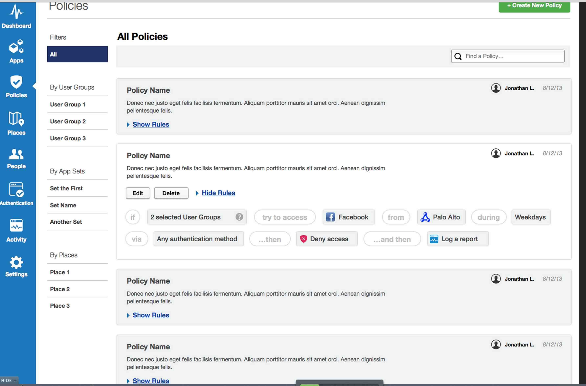

<!--TOC-->
# Background

# Application Policy Management
## Policy Management
All policies: 


###	GET /mam/v1/login?fetchPolicy 


#### Response
Include via reference to a sample  JSON file in Git that can be used with curl scripts (uses custom 
Markdown2 tag)
<<(json/create-location-radius.json)

* [json full link](https://github.com/lakamsani/mam/blob/master/json/create-location-radius.json)
* [json short link](json/create-location-radius.json)


Inline include via copy/paste from the JSON file above.
```json

{
    "name":"gaya",
    "description":"gaya",
    "radius": "100",
    "sub_locations": [],
    "coordinates": [
       {
           "longitude": 77.58825,
           "latitude": 12.991323
       }
     ]
 }

```
#### Errors

## Geofence
## Timefence


# Application Management and App Store

## App Store

## App Requests

# Application Wrapping Workflow

# Audit and Stats

## Stats
## Audit

# Config Management